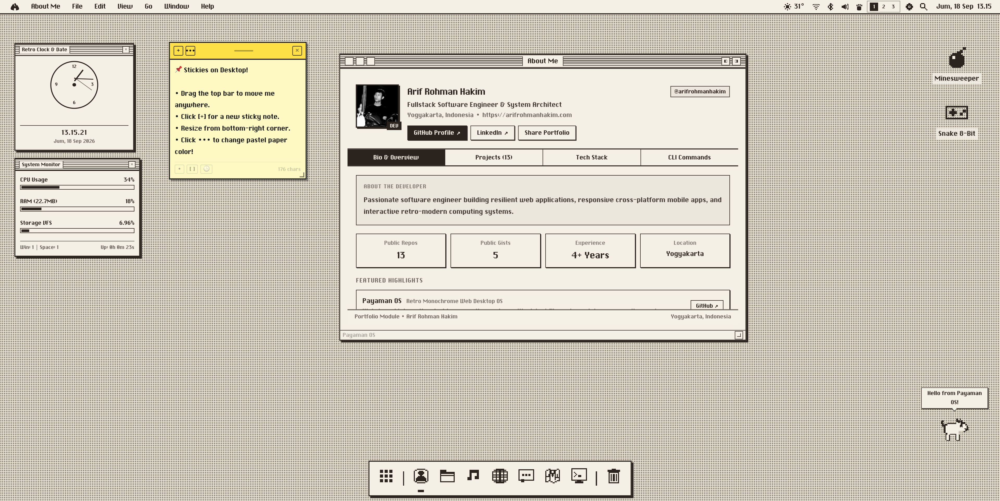

# 🖥️ Payaman OS

> **Payaman OS** is a retro, monochrome web-based desktop operating system inspired by the timeless aesthetics of *Classic Mac OS (System 6/7)*, blended with modern web performance, high modularity, and rich interactivity.


*Payaman OS Desktop — [View Full Resolution Preview](https://www.awesomescreenshot.com/image/63688127?key=700461d2bb8798ff8f70df36b933f8a5)*

---

## 🌟 Key Features

### 🎨 1. Retro-Modern Monochrome Aesthetic
- **Pure 1-Bit Pixel Art Design**: Crisp, high-contrast monochrome UI tailored for clarity and retro charm.
- **CRT Scanlines Simulation**: Authentic cathode-ray tube screen filter toggleable from the Control Center / Preferences.
- **Dither & Halftone Patterns**: Classic Mac-style desktop background patterns including dot matrix, halftone, vintage grids, or custom wallpapers.
- **Magnified Floating Dock**: Smooth macOS-style icon magnification upon hover with running app indicators and customizable orientation (Bottom, Left, Right).
- **Interactive System Menu Bar**: Featuring Apple/Cave menu, context-aware active application menus, volume/Wi-Fi/battery indicators, and real-time clock.

---

### 📂 2. Virtual File System & Finder (File Manager)
- **Persistent Virtual File System (VFS)**: UNIX-like hierarchical directory structure (`/home/arif`, `/system`, `/tmp`) persisted via browser LocalStorage.
- **Quick Look (Instant <kbd>Spacebar</kbd> Preview)**: Select any file in Desktop or File Manager and press Space to open a lightweight preview modal for plain text, Markdown, SVG/pixel images, audio, PDF, and spreadsheets without launching full applications.
- **Wastebasket / Trash Lifecycle**:
  - Deleted files move to Trash safely with original location and timestamp metadata.
  - Dynamic dock and window trash icons that switch between **Empty** and **Crumpled Overflow Paper** states.
  - **Put Back / Restore** functionality to instantly return files to their original directories.
- **Google Drive Cloud Integration**: Connect your Google Drive account to explore, download, and upload cloud files directly within the OS.
- **Drag & Drop File Import**: Drag files from your computer desktop directly into the browser to import them into the VFS.

---

### 🪟 3. Window Manager & Smart Navigation
- **Multi-Windowing Experience**: Drag, resize, minimize, maximize, and focus multiple concurrent application windows.
- **Window Snapping & Split Screen**: Tile windows to the left or right halves of the screen using keyboard shortcuts (<kbd>⌥ ←</kbd> / <kbd>⌥ →</kbd>).
- **App Switcher (<kbd>⌥ Tab</kbd> / <kbd>⌘ Tab</kbd>)**: Fast cycling between running applications with live window previews.
- **Virtual Spaces (<kbd>Ctrl 1/2/3</kbd>)**: Separate digital workspaces to organize and declutter active windows.
- **Spotlight Search (<kbd>⌘ Space</kbd>)**: Quick search launcher for applications, documents, and system settings.
- **Launchpad**: Fullscreen 8-bit application grid overview.

---

### 🔊 4. 8-Bit Synthetic Sound Engine (Web Audio API)
- Real-time procedural audio synthesis without heavy external audio asset downloads:
  - Classic Macintosh *Startup Chime*.
  - UI clicks and interaction beeps.
  - *Trash Crumple Sound* when moving files to wastebasket.
  - *Trash Emptying Sound* and *File Restoration Chimes*.

---

## 📱 Built-in Applications

| Application | Icon | Description |
| :--- | :---: | :--- |
| **Files (Finder)** | 📁 | Dual VFS & Google Drive file manager with Grid/List views, upload, rename, and keyboard navigation. |
| **Terminal CLI** | 📟 | Interactive UNIX-like shell (`ls`, `cat`, `mkdir`, `rm`, `echo`, `neofetch`, `matrix`, etc). |
| **MacPaint** | 🎨 | 1-bit raster graphics studio with pencils, brushes, geometric tools, and retro dither fill patterns. |
| **PayamanCalc (Sheets)** | 📊 | Interactive spreadsheet editor supporting formulas, cell formatting, and Excel/CSV imports. |
| **Write** | 📝 | Clean text & Markdown document editor with open/save capability. |
| **Payaman Chat** | 💬 | Retro-themed AI conversational assistant. |
| **Browser** | 🌐 | Retro web browser simulator with bookmarks, tabs, and history navigation. |
| **Maps** | 🗺️ | 8-bit styled digital map explorer with search and waypoint routing. |
| **iTunes** | 🎵 | Vintage audio player with visualizer and playlist support. |
| **Gallery & Photobot** | 🖼️ | Image viewer and retro camera studio with live capture and 1-bit pixel filters. |
| **Weather** | ☀️ | Real-time weather forecast display with pixel weather graphics. |
| **Calendar & Calculator** | 📅 | Monthly calendar planner and classic desk calculator. |
| **Minesweeper & Snake** | 💣 | Nostalgic arcade puzzle and snake games. |
| **Desktop Pet** | 🐾 | Interactive pixel-art companion wandering across your desktop screen. |
| **Sticky Notes & Widgets** | 📌 | Desktop sticky memos and floating widgets (Analog Clock, Mini Calendar, RAM Monitor). |
| **Wastebasket** | 🗑️ | Trash manager with *Put Back*, *Delete Immediately*, and *Empty Trash* workflows. |
| **Preferences** | ⚙️ | Central control panel for Appearance, Wallpapers, CRT Scanlines, Dock, and Audio. |
| **About / Portfolio** | ℹ️ | Interactive system specs overview and developer portfolio. |

---

## ⌨️ Keyboard Shortcuts

| Shortcut | Action |
| :--- | :--- |
| <kbd>Space</kbd> | **Quick Look**: Toggle instant preview for selected item |
| <kbd>⌥ Tab</kbd> / <kbd>⌘ Tab</kbd> | **App Switcher**: Cycle through open application windows |
| <kbd>⌘ Space</kbd> | Toggle **Spotlight Search** |
| <kbd>⌥ ←</kbd> / <kbd>⌥ →</kbd> | **Snap Window**: Tile window to left / right split screen |
| <kbd>Ctrl 1</kbd> / <kbd>2</kbd> / <kbd>3</kbd> | Switch between **Virtual Spaces** |
| <kbd>F2</kbd> | **Rename** selected file or folder in File Manager |
| <kbd>Del</kbd> / <kbd>⌫</kbd> | **Move to Trash** |
| <kbd>↵ Enter</kbd> | Open selected item or **Put Back** from Trash |
| <kbd>Esc</kbd> | Close dialog modal / Quick Look / Context Menu |

---

## 🛠️ Architecture & Tech Stack

- **Core Framework**: [React 19](https://react.dev/) + [Vite](https://vitejs.dev/)
- **Styling & Theming**: [Tailwind CSS](https://tailwindcss.com/) with custom CSS variables for instant monochrome theme switching
- **Graphics & Icons**: Pure Vector SVG Crisp-Edges 8-Bit Pixel Art Graphics
- **Sound Engine**: [Web Audio API](https://developer.mozilla.org/en-US/docs/Web/API/Web_Audio_API) Synth (Zero External Audio File Overhead)
- **State Management**: Custom Reactive Hooks & Service/Repository Architecture

---

## 🚀 Getting Started

### Prerequisites
- [Node.js](https://nodejs.org/) (version 18.0 or higher recommended)
- `npm`, `pnpm`, or `yarn`

### Installation & Local Setup

1. **Clone the Repository:**
   ```bash
   git clone https://github.com/arifrohmanhakim/Payaman-OS.git
   cd Payaman-OS
   ```

2. **Install Dependencies:**
   ```bash
   npm install
   ```

3. **Start Development Server:**
   ```bash
   npm run dev
   ```

4. **Open in Browser:**
   Navigate to `http://localhost:5173` in your web browser.

5. **Build for Production:**
   ```bash
   npm run build
   ```

---

## 📄 License

This project is licensed under the [MIT License](LICENSE).

Crafted with ❤️ by **[Arif Rohman Hakim](https://github.com/arifrohmanhakim)**.
